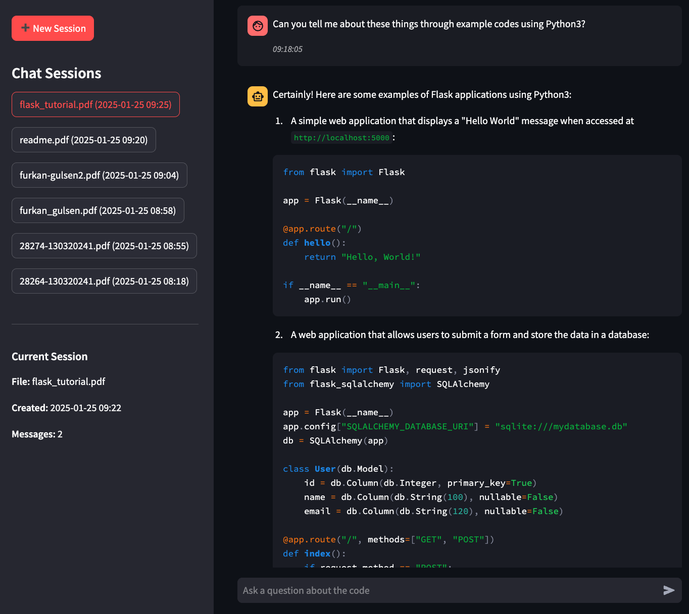

# Simple RAG Chat with Ollama 🤖



A Retrieval-Augmented Generation (RAG) based chat application that allows users to have intelligent conversations about their documents and code files. The application uses local LLMs through Ollama for processing and responding to queries.

## Features

- 📁 Support for multiple file formats (TXT, PDF, Python, JavaScript, Java, C++, C, C#)
- 💬 Interactive chat interface with message history
- 🤖 Local LLM integration via Ollama
- 🔍 Smart context retrieval using ChromaDB vector store
- 📊 Session management with MongoDB
- 🎯 Specialized models for code and general queries

## Prerequisites

- Python 3.11+
- MongoDB
- Ollama

## Installation

### 1. Clone the Repository
```bash
git clone https://github.com/Furkan-Gulsen/Simple-Rag-Chat-with-Ollama
cd Simple-Rag-Chat-with-Ollama
```

### 2. Create and Activate a Python 3.11 Virtual Environment
```bash
# Create a virtual environment using Python 3.11
python3.11 -m venv venv

# Activate the virtual environment
source venv/bin/activate  # On Windows: venv\Scripts\activate
```

### 3. Install the Required Packages
```bash
pip install --upgrade pip
pip install -r requirements.txt
```

### 4. Install and Set Up Ollama
```bash
# On macOS
brew install ollama

# On Linux
curl -fsSL https://ollama.com/install.sh | sh

# After installation, pull the required models
ollama pull mistral    # For general conversation
ollama pull codellama  # For code-related queries
```

### 5. Start MongoDB
```bash
# Using Docker (recommended)
docker run -d -p 27017:27017 --name mongodb mongo

# Or use your system's MongoDB service
```


## Usage

### 1. Start the Application
```bash
streamlit run src/frontend/streamlit_app.py
```

### 2. Open Your Browser
Navigate to `http://localhost:8501`

### 3. Use the Application
- Click "➕ New Session" to start a new chat
- Upload a file (supported formats: TXT, PDF, PY, JS, JAVA, CPP, H, C, CS)
- Ask questions about the uploaded file
- View chat history and switch between different sessions

## Architecture

### Backend
- **`ChatManager`**: Main coordinator for chat sessions and file processing
- **`RAGEngine`**: Handles document processing and query responses
- **`FileProcessor`**: Manages file reading and processing
- **Repositories**: Handle data persistence (MongoDB)

### Frontend
- **`StreamlitUI`**: Manages the user interface and state
- **Session Management**: Tracks active chats and file uploads
- **Message Display**: Shows chat history with timestamps

## Models

The application uses two Ollama models:

1. **Mistral** (`mistral`):
   - Used for general conversation
   - Better at understanding context and natural language
   - Temperature: 0.7 for more creative responses

2. **CodeLlama** (`codellama`):
   - Specialized for code-related queries
   - Better at understanding programming concepts
   - Temperature: 0.2 for more precise responses

The system automatically switches between models based on the query content.

## Data Storage

- **MongoDB**: Stores chat sessions, messages, and file metadata
- **ChromaDB**: Vector store for document embeddings and semantic search
- **File System**: Temporary storage for uploaded files during processing
